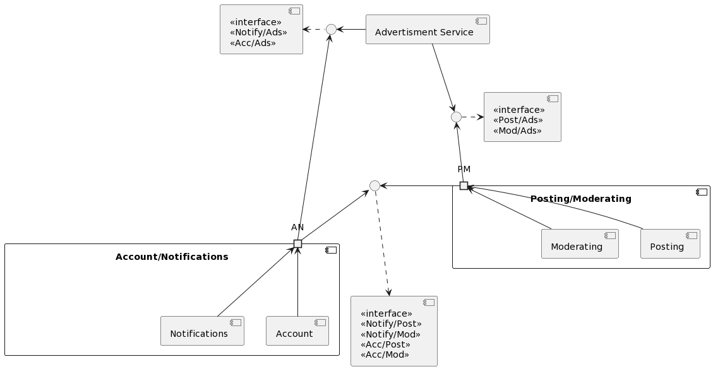

Microservices Breakdown
=======================

This is a breakdown of the microservices that make up the application. Documentation
for each service is available in its respective directory. We have decided in this preliminary
stage that each group will implement their service using Java with Spring Boot, as this is
what everyone is most comfortable with. This may change in the future.

📌 **Please Note**: Sequence diagrams can be viewed by navigating to individual usecases using the
links provided here.

==⚠️ TODO: Please double check that we're not missing anything from the milestone 2 requirements.==

<!-- TOC -->
  * [Group Allocation](#group-allocation)
  * [Component and Connector Diagram](#component-and-connector-diagram)
  * [Deployment Diagram](#deployment-diagram)
  * [Services](#services)
    * [Accounts and Notifications Service](#accounts-and-notifications-service)
    * [Ads and Monetization Service](#ads-and-monetization-service)
    * [Posts and Moderation Service](#posts-and-moderation-service)
<!-- TOC -->

## Group Allocation

The members of our group will work on the following services:

| Service          | Team Members       |
|------------------|--------------------|
| Posts/Moderation | Aaron Y and Matt M |
| Advertisements   | Jack H             |
| Accounts         | Drew P and Matt L  |
| Frontend         | Jack H and Matt L  |

## Component and Connector Diagram

==⚠️ TODO: Please add a component and connector diagram. This can be accomplished by creating a .puml file
in a diagrams directory, writing it there, and then running Make to generate the diagram. Then,
link it here with the `` syntax. See usecase readmes for examples.==

## Deployment Diagram

We are deploying to AWS Lightsail. Each microservice will be in a dockercontainer, and communicates with each other via a bridge network. We will have a central PostgreSQL database running in a container which services all microservices. The Accounts/Notification Service will be written in java with Spring Boot. The Posts/Moderation Service will be written in java with Spring Boot. The Ads Service will be written in java with Spring Boot. The frontend will be written with SvelteKit and deployed with Node.js.

## Services

### Accounts and Notifications Service

The API documentation for this service can be found [here.](AccountsNotifications/openapi.yaml)

This service is responsible for handling user accounts and notifications. The documentation
for the usecases that this service implements can be found [here.](../usecases/AccountManagement/README.md)

### Ads and Monetization Service

The API documentation for this service can be found [here.](AdsMonetization/openapi.yaml)

This service is responsible for handling advertisements. The documentation
for the usecases that this service implements can be found [here.](../usecases/AdsMonetization/README.md)

### Posts and Moderation Service

The API documentation for this service can be found [here.](PostsModeration/openapi.yaml)

This service is reponsible for handling posts and comments. The documentation
for the usecases that this service implements can be found [here.](../usecases/Posting/README.md)
