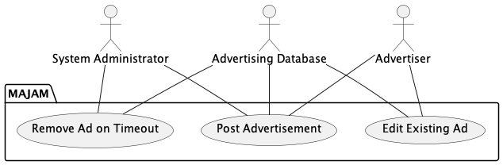
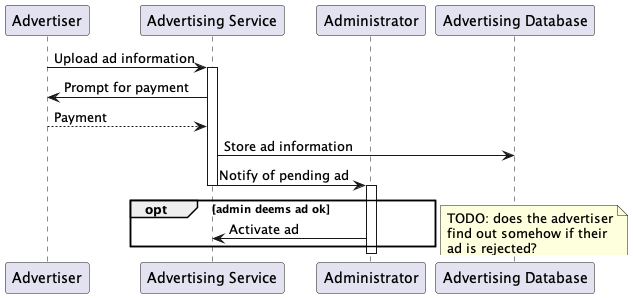
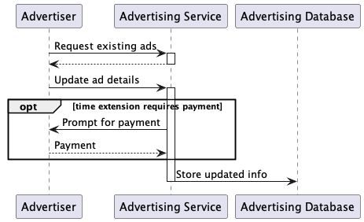
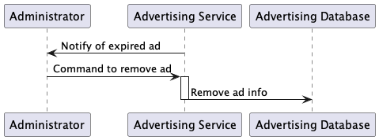

Ad/Monetization Usecases
========================

<!-- TOC -->
  * [Post Advertisement](#post-advertisement)
    * [Description](#description)
    * [Sequence Diagram](#sequence-diagram)
  * [Edit Existing Ad](#edit-existing-ad)
    * [Description](#description-1)
    * [Sequence Diagram](#sequence-diagram-1)
  * [Remove the Ad on Timeout](#remove-the-ad-on-timeout)
    * [Description](#description-2)
    * [Sequence Diagram](#sequence-diagram-2)
<!-- TOC -->

## Post Advertisement

### Description

**Goal in context**: The advertising business will have their advertisements shown on the website for a fee.

**Actors**:

- Advertiser,
- System Administrator, and
- Advertising Database

**Preconditions**: We assume that the advertiser has a business and
advertisements available to put on the website. We also assume that the
website only allows still images for advertisements. No videos will be
allowed. We assume that the advertiser is logged in to a business
account.

**Main Flow**:

1. The advertiser goes to the view advertisement page. They can click on create advertisement to go to the create advertisement page.
2. The advertisement fills in details of the advertisement on the create advertisement page and presses create advertisement button.
3. The system prompts the advertiser for payment if they are creating a
   new advertisement.
4. The advertisement is posted on the website by the administrator

**Issues**:

1. There is no actual payment page that gets the payment from the advertiser
2. If there are more advertisements registered for showing on the page than
   can be shown on the page there might need to be a randomization
   algorithm that randomly puts ads on the page.

**Extensions**:
The advertiser can just view the ad that they have instead of creating an
ad.

### Sequence Diagram

## Edit Existing Ad

### Description

**Goal in Context**: The advertiser changes their ad on the website.
They can either change the ad image or the shape of the image or the
duration for the image to be up. They could also take down the ad.

**Actors**: Advertiser, Advertising Database

**Preconditions**: We assume that the advertiser is logged into a business
account.

**Main Flow**:

1. The advertiser views an existing
   advertisement.
2. The advertiser clicks on the edit button
   and is shown a page that allows the advertiser to
   switch the image of the advertisement, change
   the shape of the image, or change how long they
   have the image up. They can also take down the
   ad in the edit page. They won’t be refunded for
   opting for less time for the advertisement.
3. The advertiser can either make changes
   or exit. If the advertiser wants to change how
   long they have the image up, they may have to be
   prompted for another payment.
4. The advertisement has been edited.

**Issues**:
1. There is no payment method on the
   website for paying for changes to the ad.

**Extensions**: The advertiser may just want to view the
advertisement on the edit page and opt for no
changes to the ad.

### Sequence Diagram

## Remove the Ad on Timeout

### Description

**Goal in context**: The advertisement needs to be taken down by the
advertisement after the allotted time.

**Actors**: System administrator, Advertising Database

**Preconditions**: The advertisement has just passed its allotted time.

**Main Flow**:
1. The system administrator is notified that the
   advertisement database has an ad in it that has
   run out of time.
2. The system administrator removes the
   advertisement from the website and deletes the
   data of the advertisement from the database.
3. The advertisement is removed from the
   webpage.

**Issues**:
I'm not sure how this would be implemented.

### Sequence Diagram

