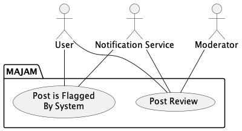
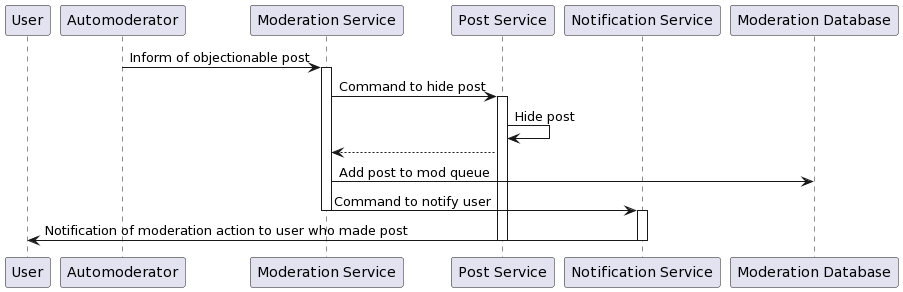
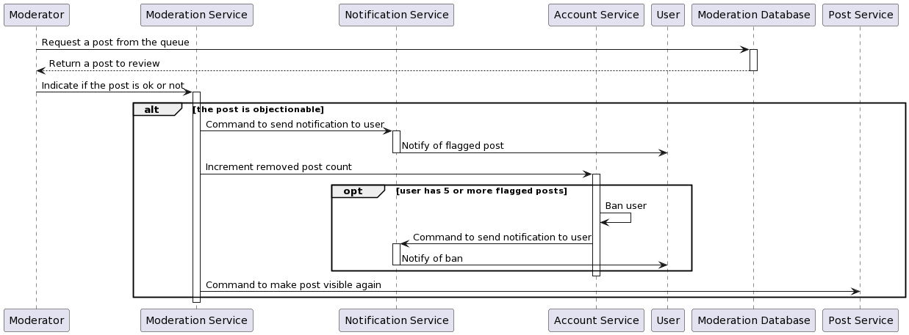

Moderation Usecases
===================

<!-- TOC -->
  * [Post is Flagged by System](#post-is-flagged-by-system)
    * [Description](#description)
    * [Sequence Diagram](#sequence-diagram)
  * [Post Review](#post-review)
    * [Description](#description-1)
    * [Sequence Diagram](#sequence-diagram-1)
<!-- TOC -->

## Post is Flagged by System

### Description

**Goal in context**: Moderates the content on the website. Important to not 
allow inappropriate content.

**Precondition**: A user has made a post, and the post was flagged by the
automoderator system

**Successful End Condition**: The post is made temporarily invisible on the
site and is added to a moderation queue

**Failed End Condition**: Post fails to be flagged and remains on the 
website

**Primary Actors**: User, Automoderator

**Secondary Actors**: Notification Service, Moderation Database

**Trigger**: The automoderator flags a post as objectionable

**Main Flow**:
1. The post is flagged
2. The post is added to a review queue and details are stored
3. User that made post is notified that the post was added to review queue

### Sequence Diagram

## Post Review

### Description

**Goal in context**: Moderator decides whether the content of the posts 
are appropriate for the website. Important to moderate website content

**Precondition**: A post exists in the queue for the moderator to review

**Successful End Condition**: Post is either released back to the website
or removed and the user notified

**Failed End Condition**: Post is never reviewed, and is stuck in the
review queue

**Primary Actors**: Moderator

**Secondary Actors**: Notification System, Account System

**Trigger**: Post is flagged by the system and added to the queue, and
moderator decides to review posts in the queue.

**Main Flow**:
1. Post is taken from the queue and reviewed by the moderator
2. Post is removed, counter of removed posts is updated, and the user
   is notified
3. If this is the user's 5th removed post, ban the user and notify

**Extensions**:

2.1. The post is deemed ok by the moderator, and is released to the
website.

### Sequence Diagram

