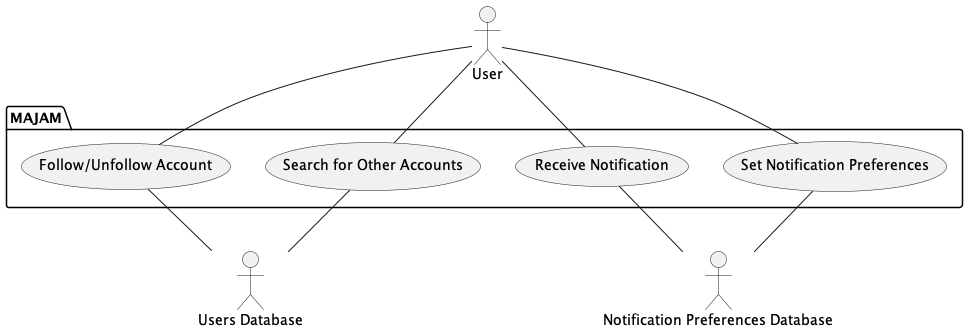
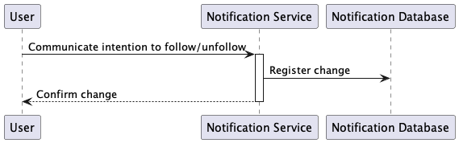
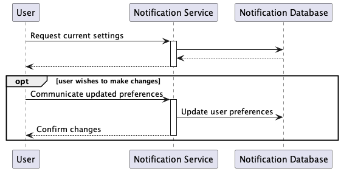
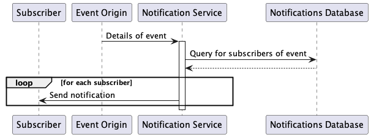

Notifications Usecases
======================

<!-- TOC -->
  * [User Searches for Other Accounts](#user-searches-for-other-accounts)
    * [Description](#description)
    * [Sequence Diagram](#sequence-diagram)
  * [User Follows/Unfollows Account](#user-followsunfollows-account)
    * [Description](#description-1)
    * [Sequence Diagram](#sequence-diagram-1)
  * [User Sets Their Notification Preferences](#user-sets-their-notification-preferences)
    * [Description](#description-2)
    * [Sequence Diagram](#sequence-diagram-2)
  * [User Receives a Notification From a Followed Account](#user-receives-a-notification-from-a-followed-account)
    * [Description](#description-3)
    * [Sequence Diagram](#sequence-diagram-3)
<!-- TOC -->

## User Searches for Other Accounts

### Description

**Goal in Context**: An existing user searches for another user to view and/or subscribe to their posts.

**Preconditions**: The user performing the search has an account, and is logged in.

**Successful end condition**: The user is viewing the account of the user they were searching for.

**Failed end condition**: The user did not find the account.

**Primary actors**: User

**Secondary actors**: Users Database

**Trigger**: A user clicks the *search* button in the main interface.

**Main Flow**:
1. The user types a search query into a search box
2. As the user types, the *Users Database* is consulted for any hits, which are displayed to the user
3. The user may click on any of the results, which would take them to that user's profile page.

**Extensions**:

Step 2: If there are no results, an appropriate error message is displayed to the user.

### Sequence Diagram

## User Follows/Unfollows Account

### Description

**Goal in context**: An existing user wishes to follow/unfollow another account in order to receive updates when that user posts new things.

**Preconditions**: The user already has an account, and is viewing the profile page of another user (perhaps after searching for them).

**Successful end condition**: The user is following/unfollowing the account they want to follow/unfollow.

**Failed end condition**: The users intention was not registered

**Primary actors**: User

**Secondary actors**: Users database

**Main Flow**:
1. The user, on the page of the other user they wish to follow, indicates their intention by clicking a *Follow* button or other appropriately named button.
2. The system communicates with the *Users Database* to register the follow relationship.

### Sequence Diagram

## User Sets Their Notification Preferences

### Description

**Goal in context**: A user decides what they want to be notified about, and by what means.

**Preconditions**: A user already has an account

**Successful end condition**: The user is able to update their notification settings to what they want.

**Failed end condition**: The user is not able to update their notification settings.

**Primary actors**: User

**Secondary actors**: Notification preferences database

**Trigger**: The user indicates their desire to update their notification preferences (e.g. through their profile page)

**Main Flow**:
1. The user navigates to a settings page to update their notification preferences
2. The user selects what they wish to be notified for
3. The user confirms the change

**Extensions**:

Step 3: The user may choose not to confirm their changes, they may click a *Cancel* button or navigate away from the page. In this case, they have simply confirmed their existing notification settings.

### Sequence Diagram

## User Receives a Notification From a Followed Account

### Description

**Goal in context**: Whereas a user has indicated they wish to receive notifications for particular events, the system delivers the notifications to them in the way they prefer.

**Preconditions**: The user has an account, has indicated they wish to be notified of at least one event, and has registered at least one contact method (e.g. email address or mobile push notification)

**Successful end condition**: The system delivers a notification to the user in the way they specify

**Failed end condition**: The system does not deliver a notification to the user despite the user's notification preferences

**Primary actors**: User

**Secondary actors**: Notification preferences database

**Trigger**: Any event for which the user has registered a preference to be notified occurs

**Main Flow**:
1. An event occurs for which a user may be notified
2. The *Notification Preferences Database* is consulted, to see if the users who can see this event want to be notified of the event, and how they want to be notified
3. The system sends a notification to the user according to their preference, if applicable.

### Sequence Diagram

