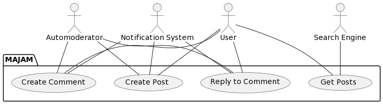

Posting Usecases
================

## Create Post

### Description

**Goal in context**: User wishes to create a post

**Precondition**: User has an existing account and is logged in

**Success**: User creates a post

**Failure**: User does not create a post

**Primary Actors**: User

**Secondary Actors**: Automoderator, Notification System

**Trigger**: User indicates to the system that they want to create a post

**Main Flow**:
1. User selects Create Post
2. User enters text content
3. User may also insert an image
4. User submits post
5. Automoderator determines if further review is required or not
6. A signal is sent to the Notification System to notify User of the Automoderator's decision.

**Extensions**:

4.1 User may cancel creating a post, in which nothing is sent out and all 
fields are reset.

### Sequence Diagram

## Create Comment

### Description

**Goal in context**: User wishes to create a comment on another user's post

**Precondition**: Both users have existing accounts and user creating 
comment is logged in

**Success**: User creates a comment

**Failure**: User does not create a comment

**Primary Actors**: User

**Secondary Actors**: Poster User, Automoderator, Notification System

**Main Flow**:
1. User indicates to the system that they want to create a comment
2. User selects Create Comment
3. User enters text content
4. User submits comment
5. Automoderator determines if further review is required or not
6. signal is sent to the Notification System to notify User of the 
   Automoderator's decision
7. If comment is approved, a signal is sent to Notification System to 
   notify Poster User of new comment

**Extensions**:

3.1 User may cancel creating a comment, in which nothing is sent out and 
all fields are reset

### Sequence Diagram

## Reply to Comment

### Description

**Goal in context**: User wishes to comment to another User's comment

**Precondition**: Both users have existing accounts and user creating 
comment is logged in

**Success**: User replies to a comment

**Failure**: User does not reply a comment

**Primary Actors**: User

**Secondary Actors**:
- Poster User,
- Commenter User,
- Automoderator, and
- Notification System

**Trigger**: User indicates to the system that they want to reply to a comment

**Main Flow**:
1. User enters text content
2. User submits reply
3. Automoderator determines if further review is required or not
4. A signal is sent to the Notification System to notify User of the 
   Automoderator's decision
5. If comment is approved, a signal is sent to Notification System to
   notify both Commenter User and Poster User of new comment.

**Extensions**:

3.1 User may cancel replying to a comment, in which nothing is sent out 
and all fields are reset.

6.1  If the Poster User and Commenter User are the same user, then just 
one notification is sent to them.

### Sequence Diagram

