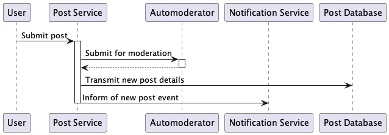

Posting Usecases
================

## Create Post

### Description

**Goal in context**: User wishes to create a post

**Precondition**: User has an existing account and is logged in

**Success**: User creates a post

**Failure**: User does not create a post

**Primary Actors**: User

**Secondary Actors**: Automoderator, Notification System

**Trigger**: User indicates to the system that they want to create a post

**Main Flow**:
1. User selects Create Post
2. User enters text content
3. User may also insert an image
4. User submits post
5. Automoderator determines if further review is required or not
6. Post is uploaded to database for storage, including the result from Automoderator
7. Inform notification service of the event so that appropriate notifications are sent.

**Extensions**:

4.1 User may cancel creating a post, in which nothing is sent out and all 
fields are reset.

### Sequence Diagram

## Create Comment

### Description

**Goal in context**: User wishes to create a comment on another user's post

**Precondition**: Both users have existing accounts and user creating 
comment is logged in

**Success**: User creates a comment

**Failure**: User does not create a comment

**Primary Actors**: User

**Secondary Actors**: Poster User, Automoderator, Notification System

**Main Flow**:
1. User indicates to the system that they want to create a comment
2. User selects Create Comment
3. User enters text content
4. User submits comment
5. Automoderator determines if further review is required or not
6. Post is uploaded to database for storage, including the result from Automoderator
7. Inform notification service of the event so that appropriate notifications are sent

**Extensions**:

4.1 User may cancel creating a comment, in which nothing is sent out and 
all fields are reset

### Sequence Diagram

## Reply to Comment

### Description

**Goal in context**: User wishes to comment to another User's comment

**Precondition**: Both users have existing accounts and user creating 
comment is logged in

**Success**: User replies to a comment

**Failure**: User does not reply a comment

**Primary Actors**: User

**Secondary Actors**:
- Poster User,
- Commenter User,
- Automoderator, and
- Notification System

**Trigger**: User indicates to the system that they want to reply to a comment

**Main Flow**:
1. User enters text content
2. User submits reply
3. Automoderator determines if further review is required or not
4. Post is uploaded to database for storage, including the result from Automoderator
5. Inform notification service of the event so that appropriate notifications are sent

**Extensions**:

2.1 User may cancel replying to a comment, in which nothing is sent out 
and all fields are reset.

### Sequence Diagram

## Get Posts

### Description

**Goal In Context**: User wishes to search for posts

**Pre-condition**: User has an existing account and is logged in

**Success**: User finds the posts they are looking for

**Failure**: User does not find the posts they are looking for

**Primary Actors**: User

**Secondary Actors**: User, Search Engine, Post Database

**Trigger**: User indicates to the system that they want browse posts

**Main Flow**:
 1. User selects Search
 2. User enters text content and adds filters
 3. User submits search to Search Engine
 4. Search Engine interacts with Post Database to find any matches
 5. Search Engine returns related posts to User, with priority for the closest matches.

**Extensions**:
 * 1.1 User may also cancel their search, in which nothing is being searched/accessed;
 * 5.1 If no related posts are found, the Search Engine will return the appropriate error message.
